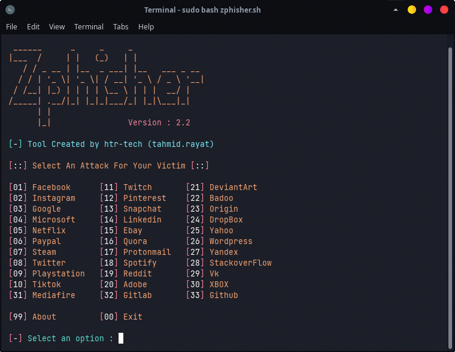

<!--/septy -->

<p align="center">
  
</p>

<p align="center">
  
  
  
  
  
</p>

<p align="center">
  
  
  
  
  </a>
</p>

<p align="center"><b>A beginners friendly, Automated phishing tool with 30+ templates.<br>& this tool is a crossover of/septy & url-masking</b></p>

##

<h3><p align="center">Disclaimer</p></h3>

<i>Any actions and or activities related to <b>Septy</b> is solely your responsibility. The misuse of this package can result in <b>criminal charges</b> brought against the persons in question. <b>The contributors will not be held responsible</b> in the event any criminal charges be brought against any individuals misusing this toolkit to break the law.

<b>This package contains materials that can be potentially damaging or dangerous for social media</b>. Refer to the laws in your province/country before accessing, using,or in any other way utilizing this in a wrong way.

<b>This package is made for educational purposes only</b>. Do not attempt to violate the law with anything contained here. <b>If this is your intention, then Get the hell out of here</b>!

It only demonstrates "how phishing works". <b>You shall not misuse the information to gain unauthorized access to someones social media</b>. However you may try out this at your own risk.</i>

##

### Features
- added url-masking into the code
- Latest and updated login pages.
- Beginners friendly
- Multiple tunneling options
  - Localhost
  - Cloudflared
  - LocalXpose
- Mask URL support 
- Docker support

##

### Installation

- Just, Clone this repository -
  ```
  git clone --depth=1 https://github.com/futuretonight/septy.git
  ```

- Now go to cloned directory and run `septy.sh` -
  ```
  $ cd septy
  $ bash/septy.sh
  ```

- On first launch, It'll install the dependencies and that's it. ***Septy*** is installed.

##

### Installation (Termux)
You can easily install/septy in Termux by using tur-repo
```
$ pkg install tur-repo
$ pkg install septy
$ septy
```
### A Note : 
***Termux discourages hacking*** .. So never discuss anything related to /septy* in any of the termux discussion groups. For more check : [wiki](https://wiki.termux.com/wiki/Hacking)

##

<p align="left">
  <a href="https://shell.cloud.google.com/cloudshell/open?cloudshell_git_repo=https://github.com/htr-tech/septy.git&tutorial=README.md" target="_blank"></a>
</p>

##

### Installation via ".deb" file

- Download `.deb` files from the [**Latest Release**](https://github.com/futuretonight/septy/releases/latest)
- If you are using ***termux*** then download the `*_termux.deb`

- Install the `.deb` file by executing
  ```
  apt install <your path to deb file>
  ```
  Or
  ```
  $ dpkg -i <your path to deb file>
  $ apt install -f
  ```

##

### Run on Docker

- Docker Image Mirror:
  - **DockerHub** : 
    ```
    docker pull futuretonight/septy
    ```
  - **GHCR** : 
    ```
    docker pull ghcr.io/futuretonight/septy:latest
    ```

- By using the wrapper script [**run-docker.sh**](https://raw.githubusercontent.com/futuretonight/septy/master/run-docker.sh)

  ```
  $ curl -LO https://raw.githubusercontent.com/htr-tech/septy/master/run-docker.sh
  $ bash run-docker.sh
  ```
- Temporary Container

  ```
  docker run --rm -ti futuretonight/septy
  ```
  - Remember to mount the `auth` directory.

##

<details>
  <summary><h3>Dependencies</h3></summary>

<b/septy</b> requires following programs to run properly - 
- `git`
- `curl`
- `php`

> All the dependencies will be installed automatically when you run */septy** for the first time.
</details>

<details>
  <summary><h3>Tested on</h3></summary>

- **Ubuntu**
- **Debian**
- **Arch**
- **Manjaro**
- **Fedora**
- **Termux**
</details>

##

<h3 align="center"><i>:: Workflow ::</i></h3>
<p align="center">

</p>

##

### *thanks to creators of those tools and to their creators!*:

<table>
  <tr align="center">
    <td><a href="https://github.com/htr-tech"><br /><sub><b>htr-tech</b></sub></a></td>
    <td><a href="https://github.com/OnlineHacKing"><br /><sub><b>OnlineHacKing</b></sub></a></td>
  </tr>
<table>

<!-- // -->
